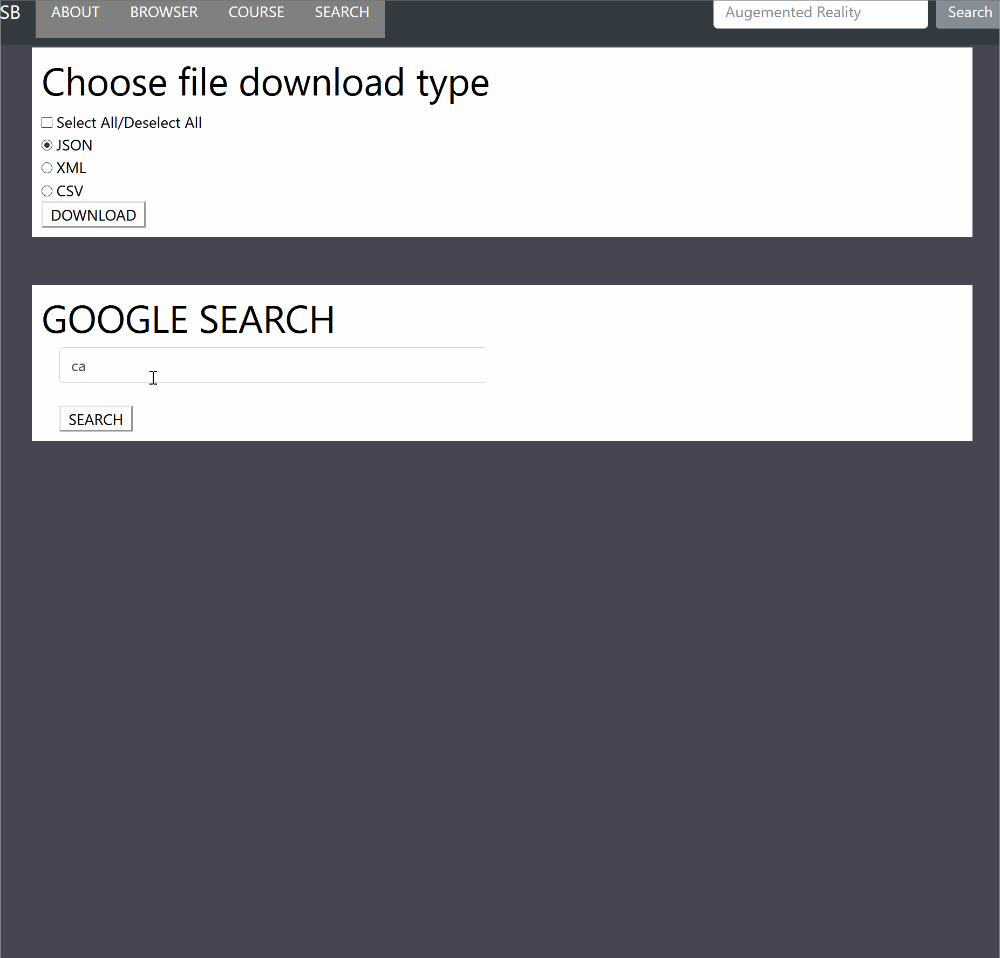
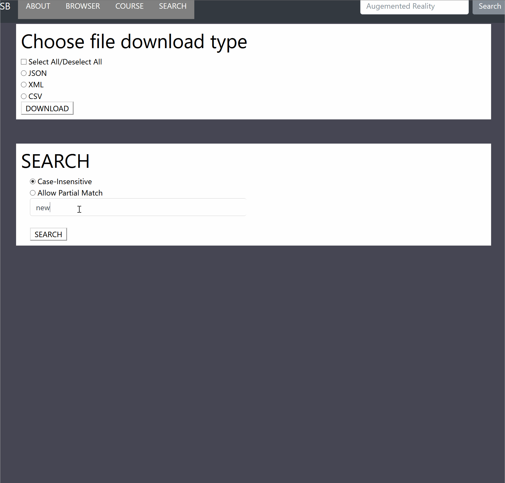

# SearchEngineWebsite
A website that allows users to search through the database and output to the screen the results.
Users can also upload their own urls they want to be saved into the database.
Also contains a section where you can parse through json,xml and csv file data and output it to the screen or
even save the data into a json,xml or csv file.
There is also a section that uses the Google Custom Search API to let users search through google.

### FRONTEND
- HTML
- CSS
- JAVASCRIPT
  -JQUERY
  
### BACKEND
- PHP

### OTHER
- Google Custom Search API

### Google Search API and downloading in JSON example

### Custom Web Search Engine Demo 

